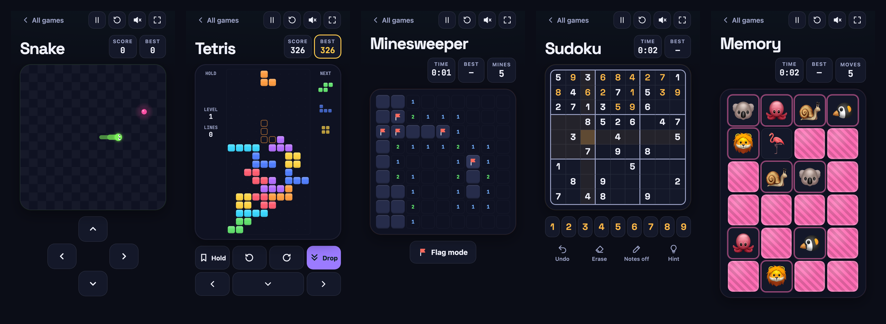
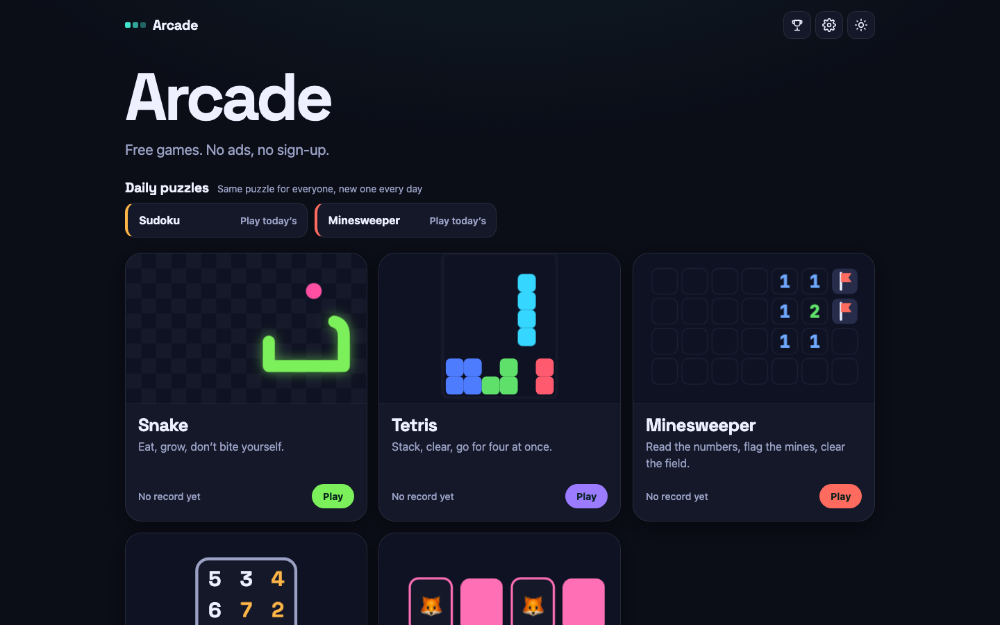

# Arcade

**Free browser games — no ads, no sign-up, works offline.**

### [▶ Play now](https://mrnednick.github.io/arcade/)



| Game                                                           | What makes it nice to play                                                                      |
| -------------------------------------------------------------- | ----------------------------------------------------------------------------------------------- |
| [Snake](https://mrnednick.github.io/arcade/snake/)             | Smooth movement between cells, two quick turns in a row never get lost, wrap-around walls mode  |
| [Tetris](https://mrnednick.github.io/arcade/tetris/)           | SRS rotation with wall kicks, hold, ghost piece, 7-bag, lock delay, auto-repeat on held keys    |
| [Minesweeper](https://mrnednick.github.io/arcade/minesweeper/) | Safe first click, chording, flags by right click or long press, three levels plus a daily board |
| [Sudoku](https://mrnednick.github.io/arcade/sudoku/)           | Generated puzzles with exactly one solution, pencil notes, undo, hints, a daily puzzle          |
| [Memory](https://mrnednick.github.io/arcade/memory/)           | 3D card flips, three board sizes, three decks                                                   |

Every game has a top-10 board with player names, keeps an unfinished game when you close the tab, runs at 60 fps on a mid-range phone and can be played with a keyboard, a mouse or a finger. Sound and vibration are synthesized on the fly and switch off with one tap.



## How it's built

- **Rules apart from drawing.** Each game's rules live in a plain `logic.ts` with no Vue in it: pure functions from one state to the next. That is what the unit tests cover — SRS kicks against a wall, a safe first click, a puzzle with exactly one solution (100 generations in about 90 ms), no 180° turn in Snake.
- **Drawing.** Snake and Tetris draw on a canvas sized for the device pixel ratio and interpolate between steps every frame; Minesweeper, Sudoku and Memory are accessible button grids with row and column labels for screen readers. Animations are CSS and `requestAnimationFrame` only — no animation library, confetti included. `prefers-reduced-motion` turns off shakes and particles.
- **One shell for every game.** Score that rolls, best score, pause when the tab is hidden, full screen, the end screen and the name prompt for the top players board. Lobby cards morph into the game board through the View Transitions API.
- **Daily puzzles.** The random seed comes from the date, so everyone gets the same Sudoku and Minesweeper board on the same day; the lobby keeps a streak.
- **Local first.** Scores, settings and the unfinished game stay in `localStorage`; there are no requests to any server. The top players board sits behind a small `ScoreBoard` interface, so an online leaderboard can replace the local one without touching the screens.
- **Offline.** A service worker precaches the app (about 350 KB); a new version activates on the next visit and the page reloads once, keeping the game in progress.

Vue 3, TypeScript, Vite, Vitest and Playwright. Lighthouse: 98–100 in every category on the lobby and on each game.

## Run locally

```bash
npm ci
npm run dev        # http://localhost:5173/arcade/
npm test           # 78 unit tests
npm run build
npm run test:e2e   # 19 scenarios on desktop and phone, against the production build
```

Every push to `main` runs lint, unit tests, the build and the end-to-end tests, then deploys to GitHub Pages.
